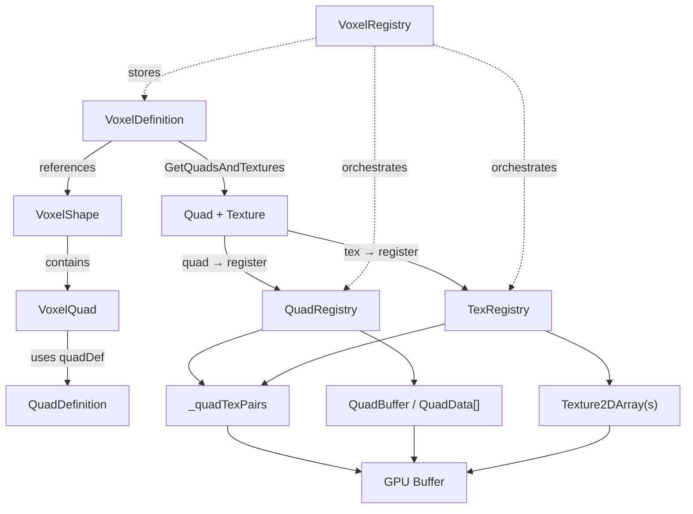

# Voxel‑Definitionen — Code mit Erklärungen

Kurzüberblick
-------------
Hier findest du die wichtigsten Code‑Ausschnitte zur Definition, Registrierung und GPU‑Vorbereitung von Voxel, jeweils gefolgt von einer kurzen Erklärung. Keine wissenschaftliche Gliederung, keine Pfadangaben — nur Code und Klartext.

1) VoxelDefinition — relevante Felder und Texture‑Auflösung
```csharp
public enum VoxelTexMode
{
    AllSame,
    TopBottomSides,
    SixSidesUnique,
    AllUnique
}

public class VoxelDefinition : ScriptableObject
{
    public MeshLayer meshLayer;
    public VoxelTexMode textureMode = VoxelTexMode.AllSame;

    public Texture2D all;
    public Texture2D top;
    public Texture2D bottom;
    public Texture2D side;
    public Texture2D front;
    public Texture2D back;
    public Texture2D left;
    public Texture2D right;

    public bool alwaysRenderAllFaces;
    public float depthFadeDistance = -1f;
    [Range(0,255)] public int glow;
    public bool collision = true;

    public VoxelShape shape;

    public List<(QuadDefinition, Texture2D)> GetQuadsAndTextures(QuadDrawCondition condition)
    {
        // Liefert für die gewünschte DrawCondition Paare aus QuadDefinition und der passenden Texture
        ... // Implementierung intern: iteriert shape.quads und nutzt FindTex
    }
}
```

Erklärung: Das Asset definiert das Rendering‑Verhalten eines Voxel‑Typs. `textureMode` steuert, wie Texturen auf Faces zugewiesen werden. `GetQuadsAndTextures` gibt genau die Quad/Texture‑Paare zurück, die für eine bestimmte DrawCondition gerendert werden sollen.

1.1) Shape & VoxelQuad — wie Formen und Quads organisiert sind
```csharp
[CreateAssetMenu(menuName = "Voxel/Shape/Voxel Shape", fileName = "VoxelShape")]
public class VoxelShape : ScriptableObject
{
    // Alle Quads, die diese Form bilden
    public VoxelQuad[] quads;
}

[Serializable]
public class VoxelQuad
{
    // QuadDefinition beschreibt Geometrie, UVs und Basisvektoren
    public QuadDefinition quadDef;

    // Wann dieses Quad gezeichnet werden soll (z. B. Up, Down, Forward...)
    public QuadDrawCondition drawCondition;
}

public enum QuadDrawCondition
{
    Always,
    Up,
    Down,
    Forward,
    Backward,
    Left,
    Right
}
```

Erklärung: `VoxelShape` fasst mehrere `VoxelQuad`s zusammen — jedes `VoxelQuad` koppelt eine `QuadDefinition` (die Geometrie) mit einer `QuadDrawCondition` (wann das Quad gerendert werden soll). `GetQuadsAndTextures` im `VoxelDefinition` filtert diese Liste nach der gewünschten DrawCondition.

1.2) QuadDefinition — Geometrie, Basis und Burst‑freundliche Struktur
```csharp
[CreateAssetMenu(menuName = "Voxel/Shape/Quad Definition", fileName = "QuadDefinition")]
public class QuadDefinition : ScriptableObject
{
    public Vector3 position00;
    public Vector3 position01;
    public Vector3 position02;
    public Vector3 position03;
    public Vector3 normal;
    public Vector3 up;
    public Vector3 right;
    public Vector2 uv00;
    public Vector2 uv01;
    public Vector2 uv02;
    public Vector2 uv03;

    public void RecalculateNormal()
    {
        CalculateBasis(out normal, out up, out right);
    }

    public QuadData ToStruct()
    {
        // Konvertiert die ScriptableObject‑Daten in eine QuadData Struktur
    }

    private void CalculateBasis(out Vector3 calculatedNormal, out Vector3 calculatedUp, out Vector3 calculatedRight)
    {
        // Berechnet Normal, Up und Right aus den Vertexpositionen (Fallbacks für degenerierte Quads)
        ...
    }

    public struct QuadData
    {
        public float3 position00;
        public float3 position01;
        public float3 position02;
        public float3 position03;
        public float3 normal;
        public float3 up;
        public float3 right;
        public float2 uv00;
        public float2 uv01;
        public float2 uv02;
        public float2 uv03;
    }
}
```

Erklärung: `QuadDefinition` enthält die vier Eckpunkte, UVs und Methoden zur Berechnung einer Burst‑freundlichen `QuadData`‑Struktur. `QuadRegistry` sammelt diese `QuadData`‑Strukturen und stellt sie später als `QuadBuffer` für die GPU bereit.

2) VoxelRenderDef — Laufzeitstruktur (Auszug)
```csharp
[BurstCompile]
public struct VoxelRenderDef
{
    public MeshLayer MeshLayer;
    public bool AlwaysRenderAllFaces;
    public half DepthFadeDistance;
    public byte Glow;
    public bool Collision;

    public uint2 Always;
    public uint2 Right;
    public uint2 Left;
    public uint2 Up;
    public uint2 Down;
    public uint2 Front;
    public uint2 Back;
}
```

Erklärung: Jedes `uint2` beschreibt einen Bereich in einer zentralen Liste (StartIndex, Count). Diese Bereiche zeigen auf die Quad/Text‑Paare, die für die jeweilige DrawCondition verwendet werden.

3) Registrierung: Aufbau eines VoxelRenderDef (Ausschnitt)
```csharp
public void Register(string packagePrefix, VoxelDefinition definition)
{
    VoxelRenderDef type = new()
    {
        MeshLayer = definition.meshLayer,
        AlwaysRenderAllFaces = definition.alwaysRenderAllFaces,
        DepthFadeDistance = (half)definition.depthFadeDistance,
        Glow = (byte)definition.glow,
        Collision = definition.collision,
        Always = RegisterFaces(definition, QuadDrawCondition.Always),
        Right = RegisterFaces(definition, QuadDrawCondition.Right),
        Left = RegisterFaces(definition, QuadDrawCondition.Left),
        Up = RegisterFaces(definition, QuadDrawCondition.Up),
        Down = RegisterFaces(definition, QuadDrawCondition.Down),
        Front = RegisterFaces(definition, QuadDrawCondition.Forward),
        Back = RegisterFaces(definition, QuadDrawCondition.Backward)
    };

    ushort id = Register(packagePrefix + ":" + definition.name, type);
    if (id == 0) return;
    _idToVoxelDefinition.Add(id, definition);
}

private uint2 RegisterFaces(VoxelDefinition definition, QuadDrawCondition condition)
{
    int baseIndex = _quadTexPairs.Count;
    int texPairsAdded = 0;
    foreach ((QuadDefinition qDef, Texture2D tex) in definition.GetQuadsAndTextures(condition))
    {
        ushort texId = RegisterTexture(tex, definition.meshLayer);
        ushort quadId = _quadRegistry.Register(qDef);
        _quadTexPairs.Add(quadId | ((uint)texId << 16));
        texPairsAdded++;
    }

    return new uint2((uint)baseIndex, (uint)texPairsAdded);
}
```

Erklärung: `Register` erzeugt ein `VoxelRenderDef` für das Asset und befüllt die Bereiche für jede DrawCondition durch `RegisterFaces`. `RegisterFaces` fügt Quad/Text‑Paare zur zentralen Liste `_quadTexPairs` hinzu.

4) Encoding der Quad/Text‑Paare
```csharp
// Jedes Element in _quadTexPairs ist ein uint:
// lower 16 bits = quadId, upper 16 bits = texId
uint entry = (uint)quadId | ((uint)texId << 16);
```

Erklärung: Dieses Packing erlaubt schnelle Übertragung als 32‑Bit Werte in einen GPU‑Buffer. Der Mesher kann quadId und texId per Bitmask/Shift extrahieren.

5) Finalisierung → GPU‑Buffers (Kurz)
- Nach Registrierung aller Voxel werden NativeArray/VoxelRenderDef und verschiedene GraphicsBuffer aufgebaut.
- QuadBuffer enthält die Quad‑Geometrien, QuadTexPairBuffer die gepackten Einträge, und es gibt Texture2DArray(s) pro MeshLayer.

6) Kleines Beispiel (Werte, kein Pfad)
- name: "stone"
- meshLayer = MeshLayer.Solid
- textureMode = VoxelTexMode.TopBottomSides
- side = (eine Seiten‑Texture)
- top = (optional andere Texture)
- bottom = (optional andere Texture)
- collision = true
- alwaysRenderAllFaces = false
- depthFadeDistance = -1
- glow = 0

Erwartet: Register erzeugt für jede Seite ein Quad|Texture Paar und trägt diese in `_quadTexPairs` ein; `VoxelRenderDef` enthält für jede Seite den Bereich (start,count).

7) Prüfpunkte nach Finalize
- Anzahl der Voxel in der Runtime‑Liste stimmt mit Anzahl registrierter Voxel überein.
- QuadTexPairBuffer.Count == Anzahl Einträge in `_quadTexPairs`.
- Texture2DArray(s) wurden für alle genutzten MeshLayer erzeugt und haben konsistente Größe/Format.

Mermaid‑Diagramm (aktualisiert)


