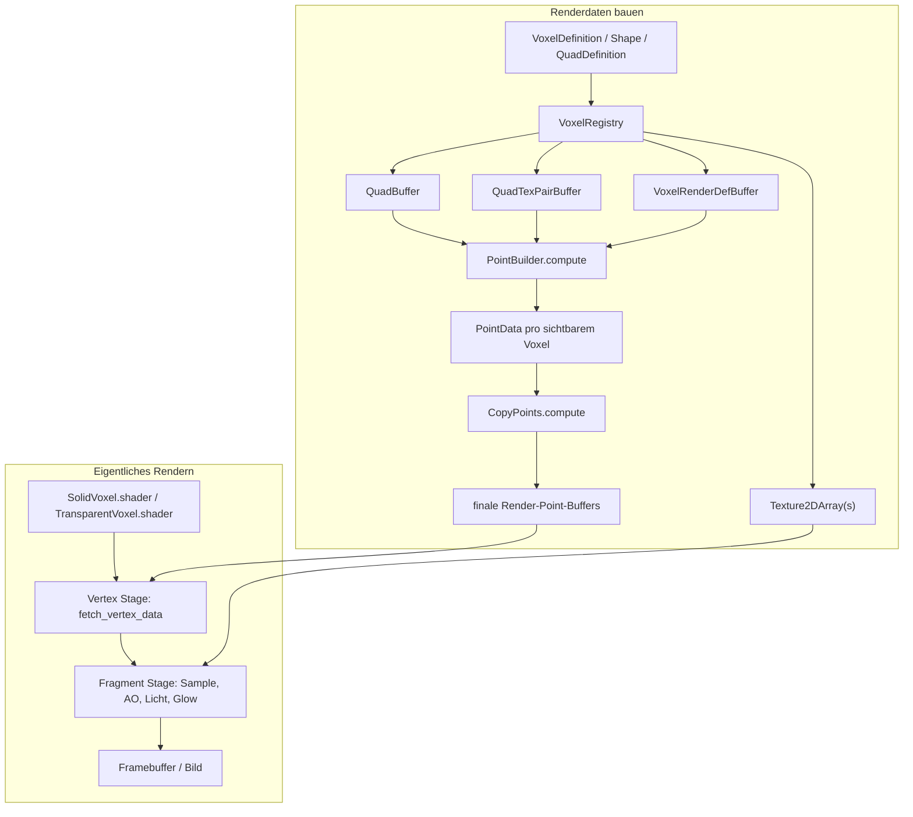

# GPU / Shader — Wie die Voxel‑Daten auf der GPU genutzt werden

Kurzüberblick
-------------
Dieses Kapitel trennt bewusst zwei Schritte:

1. **Renderdaten bauen**: Registry, Shape-/Quad-Definitionen und Compute Shader erzeugen die GPU-Buffers.
2. **Eigentliches Rendern**: Vertex- und Fragment-Shader lesen diese Buffers und malen das Bild.

Wichtig: Die Compute Shader bereiten nur die Daten vor. **Das eigentliche Färben der Pixel passiert erst im Fragment Shader**.



1) Renderdaten bauen — C# GPU‑Layout (Kurz)
```csharp
// Interne GPU‑repräsentation (C#) — wird in einen GraphicsBuffer geschrieben
private struct GPUVoxelDef
{
    private uint MeshLayer;
    private uint AlwaysRenderAllFaces;
    private half DepthFadeDistance;
    private uint Glow;
    private uint Collision;
    private uint2 shape_quad_indices_alwaysRender;
    private uint2 shape_quad_indices_right;
    private uint2 shape_quad_indices_left;
    private uint2 shape_quad_indices_up;
    private uint2 shape_quad_indices_down;
    private uint2 shape_quad_indices_front;
    private uint2 shape_quad_indices_back;

    public GPUVoxelDef(VoxelRenderDef def)
    {
        MeshLayer = (uint)def.MeshLayer;
        AlwaysRenderAllFaces = def.AlwaysRenderAllFaces ? 1u : 0u;
        DepthFadeDistance = def.DepthFadeDistance;
        Glow = def.Glow;
        Collision = def.Collision ? 1u : 0u;
        shape_quad_indices_alwaysRender = def.Always;
        shape_quad_indices_right = def.Right;
        shape_quad_indices_left = def.Left;
        shape_quad_indices_up = def.Up;
        shape_quad_indices_down = def.Down;
        shape_quad_indices_front = def.Front;
        shape_quad_indices_back = def.Back;
    }
}
```

Erklärung: Dieses Struct gehört noch zur **Build-Phase**. Es wird zeilenweise in einen Structured GraphicsBuffer geschrieben. Der GPU‑Code benötigt eine exakt passende HLSL‑Struktur (gleiche Feldtypen/Reihenfolge), damit das Memory‑Layout stimmt.

2) HLSL‑Seite: VoxelDef und QuadData
```hlsl
struct VoxelDef
{
    uint MeshLayer;
    uint AlwaysRenderAllFaces;
    half DepthFadeDistance;
    uint Glow;
    uint Collision;
    uint2 ShapeQuadIndicesAlwaysRender;
    uint2 ShapeQuadIndicesRight;
    uint2 ShapeQuadIndicesLeft;
    uint2 ShapeQuadIndicesUp;
    uint2 ShapeQuadIndicesDown;
    uint2 ShapeQuadIndicesFront;
    uint2 ShapeQuadIndicesBack;
};

struct QuadData
{
    float3 position00;
    float3 position01;
    float3 position02;
    float3 position03;
    float3 normal;
    float3 up;
    float3 right;
    float2 uv00;
    float2 uv01;
    float2 uv02;
    float2 uv03;
};

StructuredBuffer<QuadData> _Quad_buffer;
StructuredBuffer<VoxelDef> _VoxelRenderDefs;
StructuredBuffer<uint> _VoxelQuadTexPairs; // gepackte 32-bit Werte
uint _VoxelQuadTexPairsCount;
```

Erklärung: Auch das ist noch **Vorbereitung**. Der GPU‑Code liest `VoxelDef` per Index (VoxelID) und bekommt per Face‑Range (`uint2 start,count`) die Indices in `_VoxelQuadTexPairs`. Das erlaubt variable Anzahl an Quad‑Einträgen pro Voxel‑Face ohne kompliziertes Pointer‑System.

3) Packing: Quad/Tex Paar — C# ↔ HLSL
```csharp
// C# (Registry): pack quadId (low16) und texId (high16)
uint entry = (uint)quadId | ((uint)texId << 16);
```

```hlsl
// HLSL: unpack
uint get_quad_index(uint quad_tex_pair)
{
    return quad_tex_pair & 0xFFFF;
}
uint get_tex_index(uint quad_tex_pair)
{
    return (quad_tex_pair >> 16) & 0xFFFF;
}
```

Erklärung: Auf C#‑Seite wird ein 32‑Bit Wert erzeugt. Shader extrahiert per Bitmasks quadIndex und texIndex. `quadIndex` indiziert in `_Quad_buffer`, `texIndex` wird als Slice‑Index in einer Texture2DArray verwendet.

4) Texture2DArray — Sampling im Shader

- Auf Runtime‑Seite werden pro MeshLayer (Solid/Transparent/Foliage) je eine Texture2DArray gebaut. Der Shader erhält die passende Texture2DArray(s) (z. B. durch SetGlobalTexture oder Material.SetTexture).

HLSL‑Beispiel (Sampling):
```hlsl
Texture2DArray _Textures; // Bound as a single array (or per-layer arrays)
SamplerState sampler_Point;

float4 sample_texture_array(Texture2DArray texArr, float2 uv, uint slice)
{
    return texArr.Sample(sampler_Point, float3(uv, (float)slice));
}
```

Erklärung: `texIndex` wird als Slice verwendet. UVs kommen aus `QuadData.uvXX`.

5) Compute Shader‑Pipeline — Sichtbarkeit, Build und Kopie

Die eigentliche Vorarbeit passiert in den Compute Shadern:

- `PointBuilder.compute` baut daraus die `PointData`‑Einträge pro Layer.
- `ReBuildBuffers.compute` erzeugt daraus `IndexBuffer` und indirekte Draw-Argumente.
- `CopyPoints.compute` kopiert die vorbereiteten Punkte in die finalen Render-Buffers.

Im echten Kernel wird dabei direkt pro Voxelfeld geprüft, welche Faces sichtbar sind: `BuildPoints` schaut auf Nachbarn und ruft dann `add_quads` nur für die benötigten Faces auf.

`PointBuilder.compute` als Kernstück der Build-Phase:
```hlsl
void add_quads(int3 in_chunk_pos, in float3 partitionPos, in VoxelDef myDef, uint2 quadRange)
{
    for (uint i = 0u; i < quadRange.y; i++)
    {
        uint quad_tex_pair = get_quad_tex_pair(quadRange.x + i);

        PointData p;
        p.position = (float3)in_chunk_pos + float3(partitionPos.x, 0, partitionPos.z);

        uint4 packed = uint4(quad_tex_pair, 0, 0, 0);
        set_sun_light(packed, uint4(15, 15, 15, 15));
        set_artificial_light(packed, uint4(0, 0, 0, 0));

        uint quadIndex = get_quad_index(packed);
        QuadData quad = _Quad_buffer[quadIndex];
        uint ao_mask = 0;

        // AO und Zusatzdaten werden hier nur vorbereitet, nicht gerendert
        set_ao(packed, ao_mask);
        p.packed = packed;

        switch (myDef.MeshLayer)
        {
        case 0: _SolidPointsOut.Append(p); break;
        case 1: _TransparentPointsOut.Append(p); break;
        case 2: _FoliagePointsOut.Append(p); break;
        default: break;
        }
    }
}

[numthreads(4, 4, 4)]
void BuildPoints(uint3 id : SV_DispatchThreadID)
{
    if (any(id >= uint3(_PartitionSize))) return;

    PartitionMetadata metadata = _Metadata[_PartitionIndex];
    int3 pos = (int3)id;
    float3 partitionWS = (float3)metadata.partitionWS;
    int3 in_chunk_pos = pos + int3(0, partitionWS.y, 0);
    uint voxelId = get_voxel(_MainChunk, in_chunk_pos);

    if (voxelId == 0) return;

    VoxelDef myDef = get_voxel_def(voxelId);
    add_quads(in_chunk_pos, partitionWS, myDef, myDef.ShapeQuadIndicesAlwaysRender);
}
```

Erklärung: Hier werden noch keine Pixel gerendert. Der Compute Shader baut nur die Renderdaten auf: er wählt Quads, Texturen und Zusatzdaten wie Licht, AO oder Glow aus und schreibt daraus `PointData` in Append-Buffers.

6) PointData.packed — zusätzlicher per‑Point Zustand

- Ein `PointData` enthält ein uint4 `packed` Feld, das neben quad/tex Index Platz für Licht/ao/depthFade/glow bietet. Auf der GPU existieren Hilfsfunktionen (`set_sun_light`, `set_ao`, `set_depth_fade_dist`, `set_glow`) zum Packen/Entpacken.

Kurzbeispiel (HLSL helper bereits vorhanden):
```hlsl
uint4 packed = uint4(packedPair, 0, 0, 0);
set_sun_light(packed, uint4(15,15,15,15));
set_ao(packed, ao_mask);
set_depth_fade_dist(packed, myDef.DepthFadeDistance);
set_glow(packed, myDef.Glow);
PointData p; p.packed = packed;
```

7) Binding in C# (Illustration)
```csharp
// Buffer erstellen und setzen (vereinfachtes Beispiel)
voxelRegistry.FinalizeRegistry(); // baut GraphicsBuffer(s)

// Beispiel: global setzen
Shader.SetGlobalBuffer(VoxelRenderConstants.QuadBufferNameID, voxelRegistry.QuadBuffer);
Shader.SetGlobalBuffer(VoxelRenderConstants.VoxelQuadTexPairNameID, voxelRegistry.QuadTexPairBuffer);
Shader.SetGlobalBuffer(VoxelRenderConstants.VoxelRenderDefNameID, voxelRegistry.VoxelRenderDefBuffer);

// Texture arrays (pro Layer) als globale Texturen
Shader.SetGlobalTexture(Shader.PropertyToID("_Textures"), voxelRegistry.GetTextureArray(MeshLayer.Solid));
```

Hinweis: Die Engine benutzt definierte Property‑IDs/Names; wichtig ist, dass Shader und C# dieselben Namen/IDs verwenden.

8) Performance‑Hinweise
- Verwende Texture2DArray statt Atlas, da Sampling und filtering konsistenter sind.
- Packe Daten so, dass Alignment stimmt (float3 → 16‑Byte Alignment beachten).
- Vermeide zu viele unterschiedliche Quad/Text‑Paare pro Voxel‑Typ, da `_VoxelQuadTexPairs` schnell groß werden kann.
- Prefer StructuredBuffer für Layout‑Stability (vs. ReadonlyTextureBuffer).

9) Quick Debug‑Tipps
- Prüfe Buffer‑Größen nach Finalize (Anzahl Voxel, Count QuadTexPairs, QuadBuffer.Length).
- Ersetze Texturen temporär durch sichtbare Debug‑Slices (z. B. setze jede Texture2DArray‑Slice auf eine klar unterscheidbare Farbe), um falsche TexIds zu finden.
- Logge `quadIndex`/`texIndex` in ComputeShader mit small counters (bei Editor/Compute debug builds).

Wenn du möchtest, füge ich noch:
- den exakten HLSL‑Code für `get_quad_index`/`get_tex_index` (bereits vorhanden) als eingebetteten Ausschnitt, oder
- ein kurzes Debug‑ComputeKernel‑Snippet (C# + ComputeShader Dispatch) zum Testen der Buffer‑Inhalte.
Sag kurz, was du bevorzugst.

10) Vertex Shader Stage — aus PointData werden echte Vertices
```hlsl
StructuredBuffer<PointData> _PointData;
StructuredBuffer<uint> _IndexBuffer;

VoxelVertexData fetch_vertex_data(uint vertexID)
{
    // Ein Voxel-Punkt wird zu 6 Vertices (Triangle Strip, 2 Triangles = 1 Quad)
    uint pointID = vertexID / 6;
    uint index = _IndexBuffer[pointID];
    uint cornerID = vertexID % 6;

    // PointData auslesen (enthält Position und gepackte Infos: quad/tex/light/ao)
    PointData p = _PointData[index];

    VoxelVertexData v;
    v.positionOS = p.position;
    v.packed = p.packed;

    // QuadIndex aus packed extrahieren und Quad-Geometrie laden
    uint quadIndex = get_quad_index(p.packed);
    QuadData quad = _Quad_buffer[quadIndex];

    // Triangle Strip corners (2 Triangles):
    // Triangle 1: 00-01-02, Triangle 2: 02-01-03
    switch (cornerID)
    {
       // Nimm die passende Position und UV je nach cornerID
    }

    return v;
}
```

Erklärung: Jetzt beginnt die **Render-Phase**. Aus einem `PointData` werden 6 Vertices gebaut. Der Shader nimmt dafür die passende `QuadData` und wählt je nach Corner die richtige Position und UV aus. Die Farbe entsteht erst später im Fragment Shader.

10.1) Varyings — Daten zum Fragment Shader
```hlsl
struct Varyings
{
    float4 positionCS : SV_POSITION;        // Clip space
    float2 uv : TEXCOORD0;                  // Texture UV (aus Quad)
    uint4 packed : TEXCOORD1;               // Quad/Tex ID, Light, AO, DepthFade, Glow
};

Varyings vert(uint vertexID : SV_VertexID)
{
    VoxelVertexData v = fetch_vertex_data(vertexID);

    Varyings o;
    o.positionCS = TransformObjectToHClip(v.positionOS);   // World space transform
    o.uv = v.uv;
    o.packed = v.packed;
    return o;
}
```

Erklärung: Die Daten aus `VoxelVertexData` werden in die `Varyings` Struktur kopiert. `positionCS` wird berechnet, damit die GPU die Position im Clip Space kennt. `packed` bleibt unverändert und wird an die Fragment‑Stufe weitergereicht. Die eigentliche Farbentscheidung passiert erst danach.

11) Fragment Shader Stage — Texture Sampling und Beleuchtung

Struktur des Fragment Shaders (SolidVoxel):
```hlsl
half4 frag(Varyings IN) : SV_Target
{
    // 1) Unpack Daten aus dem gepackten uint4
    FragExtraData extra = unpack_frag_extra_data(IN.packed);
    float2 uv = IN.uv;

    // 2) Texture Array Sampling (texIndex ist Slice-Index)
    float4 albedo = SAMPLE_TEXTURE2D_ARRAY(_Textures, sampler_Textures, uv, extra.texture_index);

    // 3) Ambient Occlusion Blending (basierend auf AO-Mask und Curve)
    float4 ao_color = calc_ao_color(_AOColor, albedo, _AOCurve, extra.ao, _AOIntensity, _AOPower, uv);

    // 4) Sunlight Berechnung (bilinear interpoliert aus 4 corner values)
    float sun_light = calc_sun_light(extra.sun_light, uv);

    // 5) Finale Farbe: Albedo * AO * SunLight
    return half4(ao_color.rgb * sun_light, 1);
}
```

Erklärung: **Hier wird das Bild wirklich gemalt.** Der Fragment Shader hat folgende Schritte:
1. Unpacking: `uint4 packed` wird dekodiert in texture_index, sun_light (je Corner u4), AO‑Mask (u8).
2. Texture Sampling: Die Texture2DArray wird mit UV und texIndex gesampelt.
3. AO‑Berechnung: `calc_ao_color` mischt _AOColor mit dem sampled albedo basierend auf AO‑Mask und UV.
4. Sunlight: `calc_sun_light` interpoliert die 4 Corner‑Sunlight‑Werte bilinear über UV.
5. Final: Farbe = AO‑gefärbter Albedo * Sunlight.

12) TransparentVoxel — Zusätzliche DepthFade und Glow

Transparente Voxels nutzen ein erweitertes Fragment Shader mit Depth Fading:
```hlsl
half4 frag(Varyings IN) : SV_Target
{
    FragExtraData extra = unpack_frag_extra_data(IN.packed);
    const float2 uv = IN.uv;
    const float4 albedo = SAMPLE_TEXTURE2D_ARRAY(_Textures, sampler_Textures, uv, extra.texture_index);

    const float4 ao_color = calc_ao_color(_AOColor, albedo, _AOCurve, extra.ao, _AOIntensity, _AOPower, uv);
    const float sun_light = calc_sun_light(extra.sun_light, uv);

    // Depth Fade: je näher an anderen Objekten, desto opaker wird das Material
    const float alpha = depth_fade(IN.positionSS, extra.depth_fade_dist, albedo.w);

    // Glow: emissives Leuchten
    const float glow = calc_glow(extra.glow);

    // Alpha Clip: sehr transparente Pixel verwerfen
    clip(alpha - 0.001f);

    // Finale Farbe mit Alpha
    return half4(ao_color.rgb * sun_light * glow, alpha);
}
```

Erklärung: Auch hier gilt: Die Geometrie kommt aus der Compute-/Vertex-Pipeline, aber **die sichtbare Farbe entsteht im Fragment Shader**. Der TransparentVoxel-Shader hat zusätzlich:
- `depth_fade`: Samples Scene Depth und interpoliert Alpha je nach Distanz zum nächsten Objekt. Verhindert floating‑glass‑Look.
- `glow`: Multipliziert Glow‑Faktor (aus VoxelDefinition).
- `clip`: Verwerft sehr transparente Pixel für Performance.
- `Blend SrcAlpha OneMinusSrcAlpha`: Standard‑Alpha‑Blending.

13) Helfer‑Funktionen (aus VoxelShaderCommon.hlsl)
```hlsl
// AO-Berechnung mit Corner-basierter Interpolation
float4 calc_ao_color(const float4 ao_color, const float4 albedo, const float4 ao_curve, 
                      const int ao_data, const float ao_intensity, const float ao_power, const float2 uv)
{
    // ao_data: 8-bit Mask (Nachbarn oben/oben-rechts/rechts/etc.)
    // Je Corner (bilinear über UV) wird aus ao_curve interpoliert
    // Return: gemixt zwischen ao_color und albedo
    ...
}

// Sunlight aus 4 Corner-Werten (je u4 = 0-15 brightness)
float calc_sun_light(const uint4 light_data, float2 uv)
{
    float ul = lerp(0.05f, 1.0f, light_data.x / 15.0f);  // Upper Left
    float ur = lerp(0.05f, 1.0f, light_data.y / 15.0f);  // Upper Right
    float dr = lerp(0.05f, 1.0f, light_data.z / 15.0f);  // Down Right
    float dl = lerp(0.05f, 1.0f, light_data.w / 15.0f);  // Down Left

    return lerp(lerp(dl, dr, uv.x), lerp(ul, ur, uv.x), uv.y);
}

float calc_glow(const float glow_data)
{
    return 1.0f + glow_data / 8.0f;
}
```

Erklärung: Diese Helfer‑Funktionen führen Bilinear‑Interpolation pro Quad durch und nutzen die im PointData gepackten Light/AO‑Werte für subtile Beleuchtungs‑Variation pro Quad‑Face.
